# Mac-workflow-alfred

# 1. Check hardware temp and fan speed

Credit to: https://placeless.net/blog/istats-gem-and-alfred-workflow and I improve it a little bit.

Requirement: Install [iStats](https://chris911.github.io/iStats/)

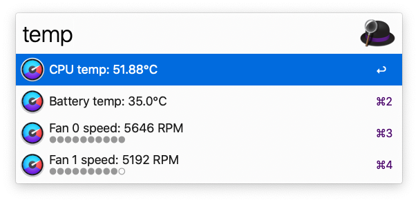

 
 

# 2. Switch Audio input/output device

Original script is from: https://github.com/rknightuk/alfred-workflows/tree/main/workflows/audio-device-selector

I modify the js file to ensure the current device is always on top. I recommend you to open the source file and modify it based on your own situation.

 
 

# 3. Mac勿扰模式增强版（需要热键配置）

Mac勿扰模式没有定时关闭的功能对于我来说一直是个痛点，写了个workflow给勿扰模式加入了定时关闭功能和番茄钟工作法的模式

本workflow配合Alfred使用，触发hotkey为nd（not disturb之意）

 

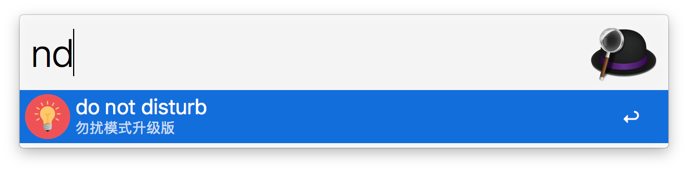
 
 

## 配置指南

1. 给勿扰模式添加全局系统热键 cmd + option + control + D，在设置-键盘-快捷键-调度中心可以找到配置勿扰模式的tab

   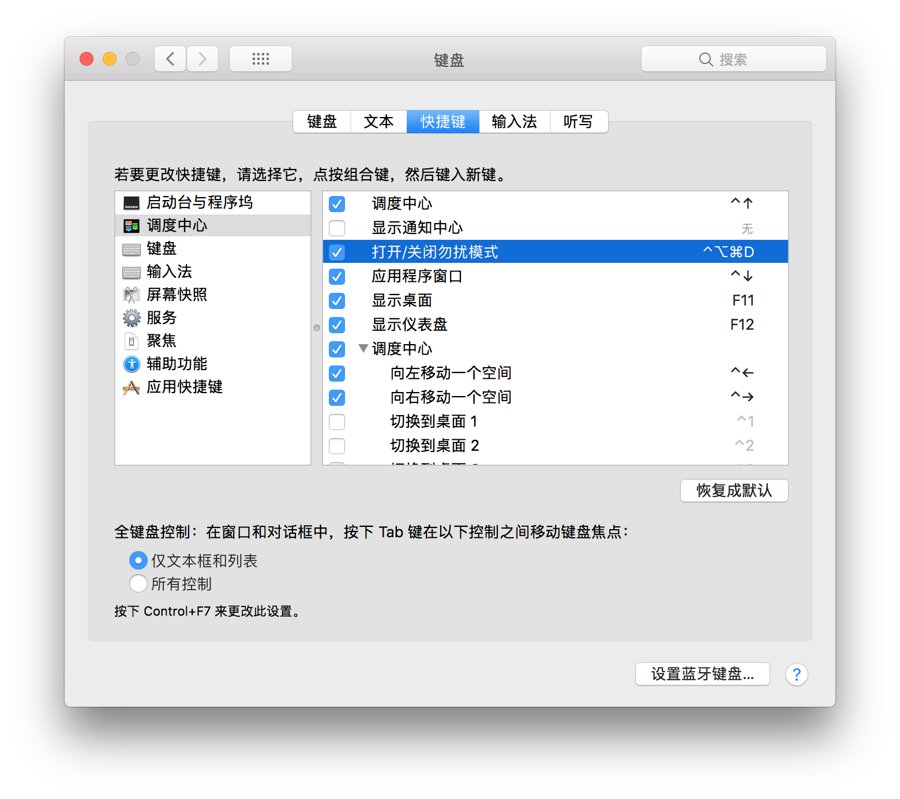

2. 下载Alfred并且点击workflow就可以直接使用

 
 
 

## 使用指南

### 普通模式：勿扰模式定时关闭

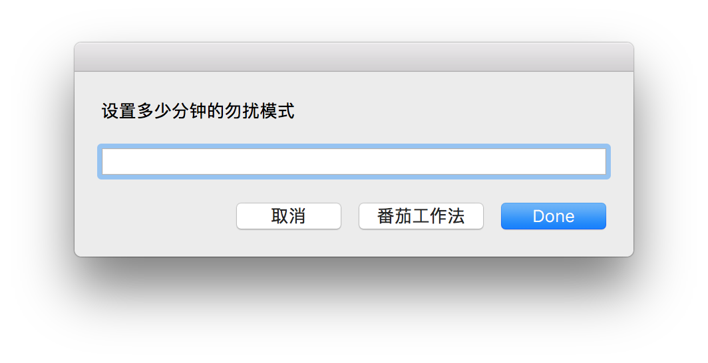

这是开始界面，输入时间以后按回车即可，整个流程非常高效。

在开始和结束时都会在右上角有弹窗提醒

 
 

### 番茄工作法模式：在一定的时间内循环番茄钟

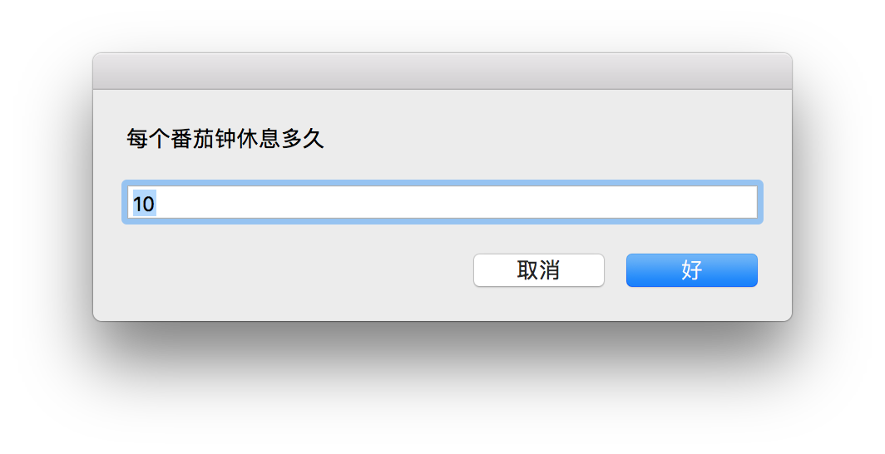

如果选择了“番茄工作法”，这里会要求输入休息时间，我设置默认为十分钟

（可以在AppleScript里面自定义）

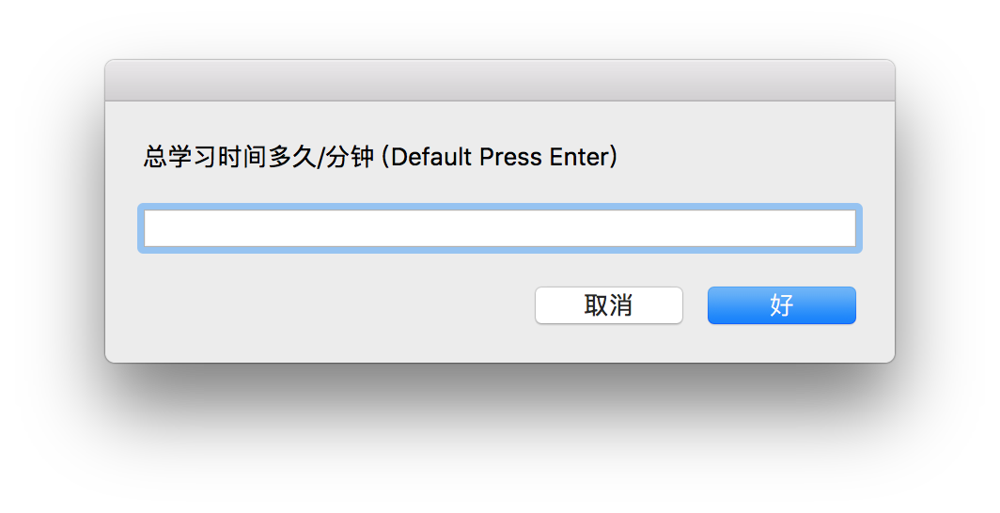

接下来输入总学习时间，接下来系统会在这个时间之内不断的循环番茄钟（fucus+休息）

默认为：一直循环番茄钟到晚上23:15分，这是我自己的习惯，可以在Applescript里面自定义。

 
 

### 如何自定义

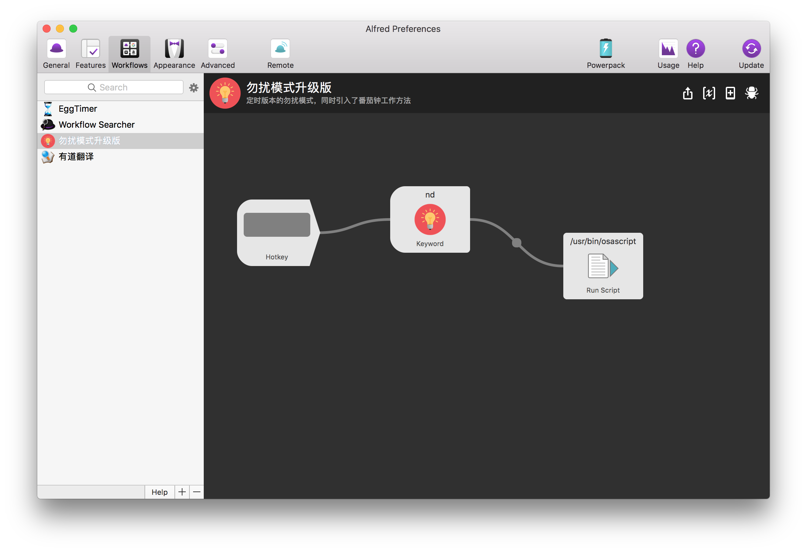

点最右边run script那个小块，展开AppleScript代码
 

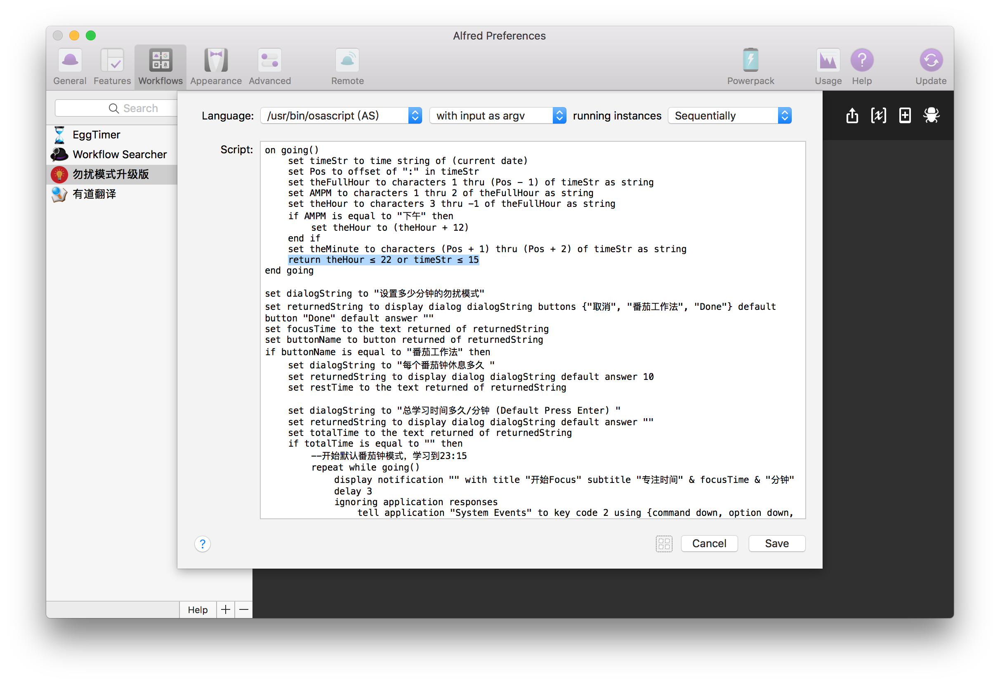

此处可以自己调整番茄钟模式的默认总时长：我设置为23:15分之前，可以根据逻辑自己更改
 

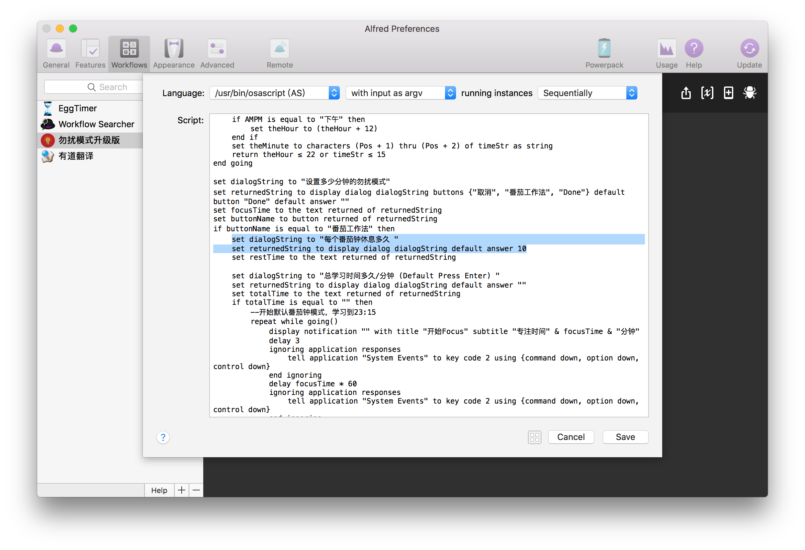

此处可以更改默认的休息时间：default answer后数字

 
 

### 右上角通知的类型

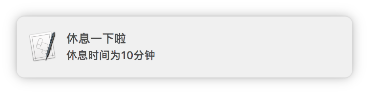

通知的数字是根据用户输入的数字而定的

 
 
 
 
 

# 4. 可指定数量，批量删除iMessages信息

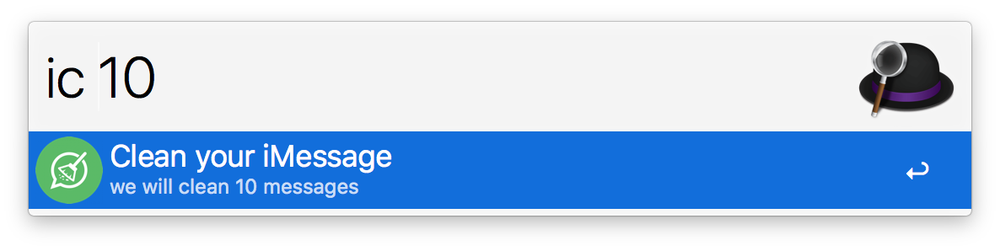
